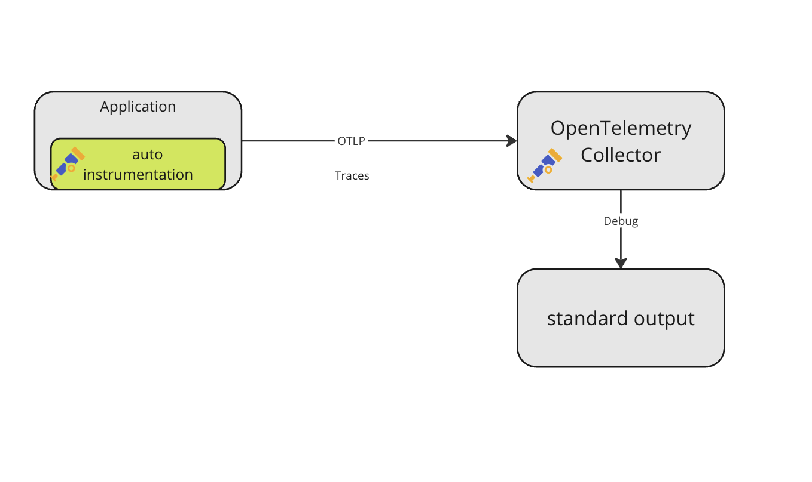

# Instrumentando Aplicações em Kubernetes com OpenTelemetry

## Introdução

Este repositório contém os arquivos e instruções necessárias para instrumentar uma aplicação Spring Boot em Kubernetes utilizando OpenTelemetry. Através deste guia, você aprenderá a coletar e analisar dados de telemetria, configurando um ambiente robusto de observabilidade.

## O Que é Telemetria?

Telemetria é o processo de coleta, transmissão e análise de dados de diferentes parâmetros de um sistema, em tempo real. No contexto de TI, isso inclui métricas, traces e logs, que são cruciais para monitorar e diagnosticar aplicações.

## Os Três Pilares da Observabilidade

1. **Métricas**: Dados quantitativos que mostram o desempenho do sistema ao longo do tempo.
2. **Traces**: Rastream o caminho de uma requisição ao longo de diferentes serviços e componentes.
3. **Logs**: Registro detalhado de eventos que ocorreram dentro do sistema.

## Onde o OpenTelemetry se Encaixa?

OpenTelemetry é uma solução de código aberto que fornece uma estrutura unificada para coletar métricas, traces e logs de aplicações distribuídas, facilitando a instrumentação automática das aplicações.

## Caso de Uso: Instrumentando uma Aplicação Spring em Kubernetes

Neste caso de uso iremos instrumentar uma aplicação em java exportando trace para o collector do open telemetry, onde o collector processa os traces e exporta span metrics para o prometheus, cujo pode ser acessado as métricas pelo grafana.


Este repositório contém os seguintes arquivos:

- **first-collector.yaml**: Configuração inicial do OpenTelemetry Collector para coletar traces.
- **first-collector-updated.yaml**: Configuração atualizada do OpenTelemetry Collector para exportar métricas para o Prometheus.
- **first-instrumentation.yaml**: Configuração da instrumentação do OpenTelemetry para a aplicação.
- **first-pod-sending-span.yaml**: Configuração do pod da aplicação Java que envia spans.
- **grafana.yaml**: Configuração do Grafana para visualizar as métricas coletadas.
- **prometheus.yaml**: Configuração do Prometheus para coletar métricas do OpenTelemetry Collector.


### Requisitos

- Um cluster Kubernetes rodando (utilizaremos Minikube).
- Cert-manager instalado no cluster Kubernetes.
- `kubectl` instalado e configurado.

### Configurando o Minikube

1. Instale o Minikube:
    ```bash
    curl -LO https://storage.googleapis.com/minikube/releases/latest/minikube-linux-amd64
    sudo install minikube-linux-amd64 /usr/local/bin/minikube
    ```

2. Inicie o Minikube:
    ```bash
    minikube start
    ```

### Instalando o Cert-Manager

1. Instale o Cert-Manager:
    ```bash
    kubectl apply -f https://github.com/jetstack/cert-manager/releases/download/v1.7.1/cert-manager.yaml
    ```

2. Verifique se os pods do Cert-Manager estão em execução:
    ```bash
    kubectl get pods --namespace cert-manager
    ```


### Instalando o OpenTelemetry Operator

1. Aplique o OpenTelemetry Operator no seu cluster:
    ```bash
    kubectl apply -f https://github.com/open-telemetry/opentelemetry-operator/releases/latest/download/opentelemetry-operator.yaml
    ```

### Configurando o OpenTelemetry Collector

1. Aplique a configuração do Collector:
    ```bash
    kubectl apply -f first-collector.yaml
    ```

### Configurando a Instrumentação

1. Aplique a configuração de Instrumentação:
    ```bash
    kubectl apply -f first-instrumentation.yaml
    ```

### Implantando a Aplicação Java

1. Aplique a configuração do Pod:
    ```bash
    kubectl apply -f first-pod-sending-span.yaml
    ```

### Verificando a Instrumentação com OpenTelemetry

1. Verifique se o pod da aplicação está em execução:
    ```bash
    kubectl get pods
    ```

2. Realize uma requisição à aplicação Java:
    ```bash
    kubectl exec -it myapp -- curl "http://localhost:8080"
    ```

3. Verifique os logs do OpenTelemetry Collector:
    ```bash
    kubectl logs $(kubectl get pods -l app.kubernetes.io/name=simplest-collector -o jsonpath="{.items[0].metadata.name}")
    ```
Neste momento, teremos a seguinte arquitetura implantada.



### Configurar o Prometheus

1. Aplique a configuração do Prometheus:
    ```bash
    kubectl apply -f prometheus.yaml
    ```

### Atualizar o OpenTelemetry Collector

1. Aplique a configuração atualizada do Collector:
    ```bash
    kubectl apply -f first-collector-updated.yaml
    ```

### Realizar Testes de Verificação

1. Realize uma requisição à aplicação Java:
    ```bash
    kubectl exec -it myapp -- curl "http://localhost:8080"
    ```

2. Verifique se as métricas chegaram no Prometheus:
    ```bash
    minikube service prometheus --url
    ```

### Configurando o Grafana para Visualização de Métricas

1. Aplique a configuração do Grafana:
    ```bash
    kubectl apply -f grafana.yaml
    ```

2. Acesse o Grafana:
    ```bash
    minikube service grafana --url
    ```

3. Importe o dashboard no Grafana:
    - No painel do Grafana, vá para **Create > Import**.
    - No campo "Import via grafana.com", insira o ID do dashboard: `19419`.
    - Clique em **Load**.
    - Configure o data source Prometheus para o dashboard importado.
    - Clique em **Import**.


APM implantado


## Conclusão

Este repositório e guia fornecem uma base sólida para a instrumentação de aplicações em Kubernetes utilizando OpenTelemetry. Com estas configurações, você terá um ambiente de observabilidade robusto que facilita a identificação e resolução de problemas de desempenho e comportamento em suas aplicações.

Se tiver dúvidas ou precisar de assistência, sinta-se à vontade para abrir uma issue.
